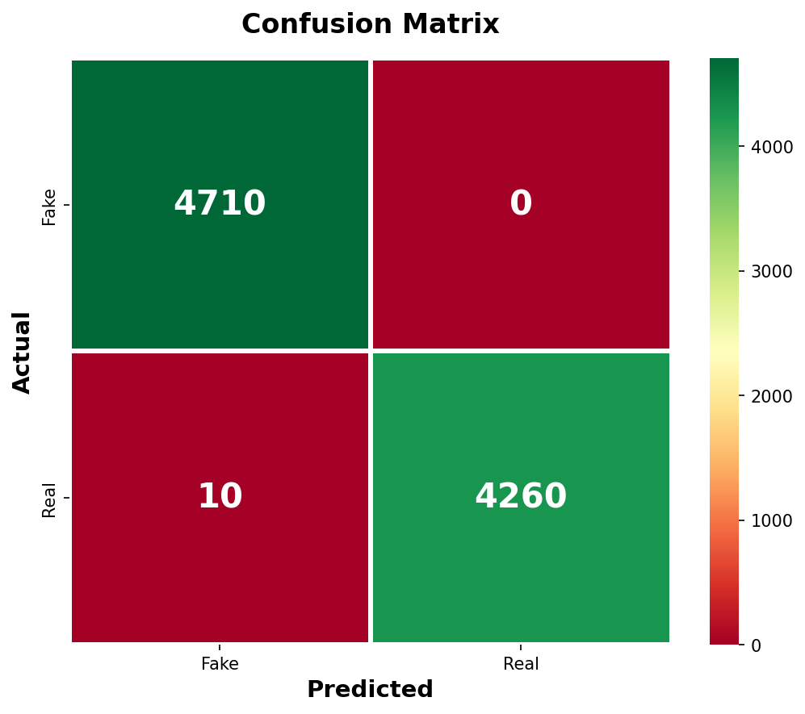
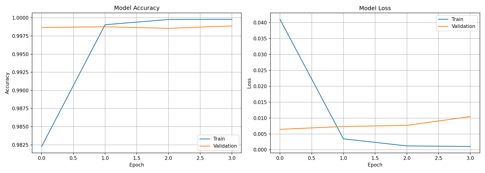
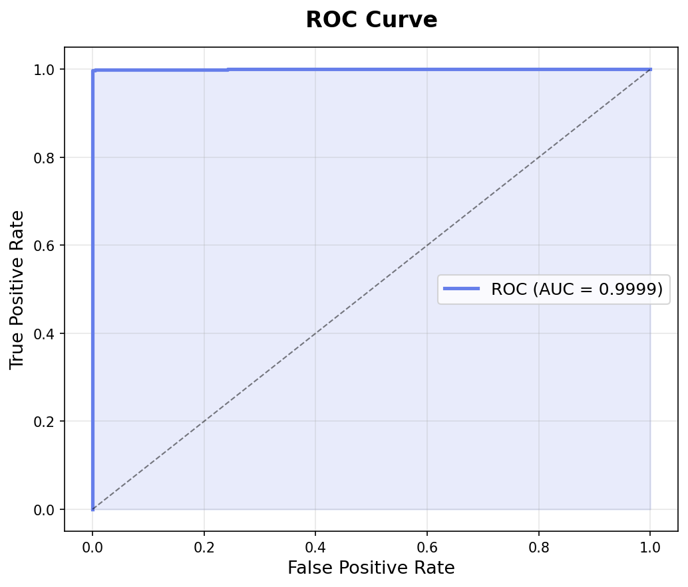
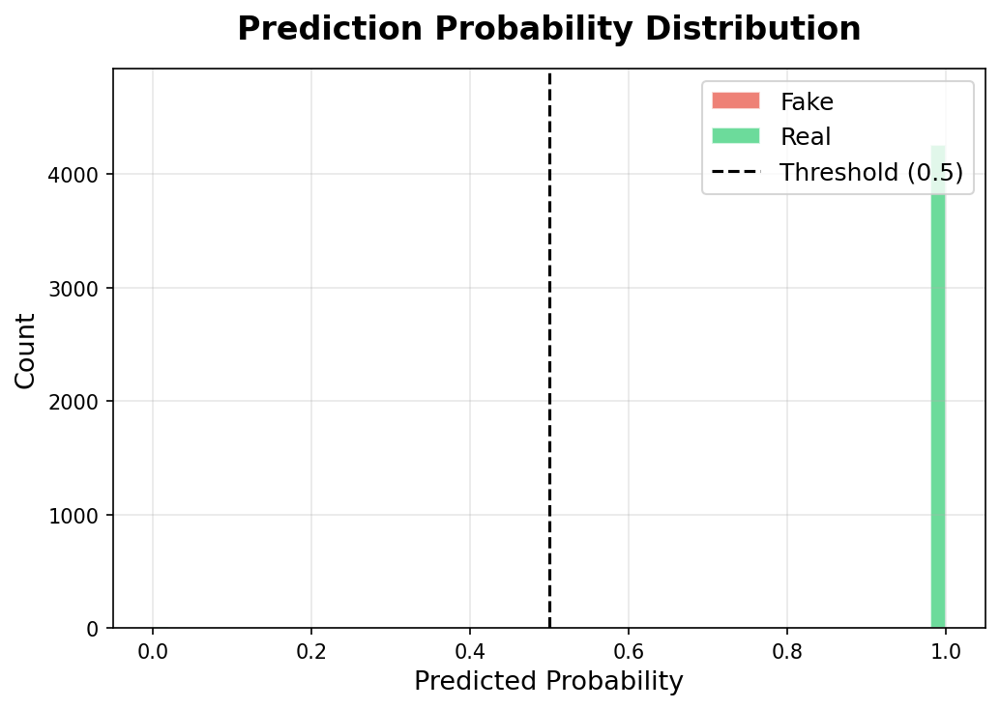

<div align="center">

# 📰 Fake News Detection using LSTM

**Deep Learning · Natural Language Processing · Binary Classification**


---

A Bidirectional LSTM neural network that classifies news articles as **Fake** or **Real** 
with an interactive Streamlit web interface for real-time predictions.

</div>

---

## ⚡ Quick Overview

```
News Article → Text Preprocessing → Tokenization → BiLSTM Model → Fake / Real
```

- 🧠 Trained on **44,898** labelled news articles  
- 🎯 Achieves **99.89% accuracy** on test data  
- 🌐 Live predictions via **Streamlit** web app  
- ⚡ GPU-accelerated training (RTX 3050 → ~2-5 min)  

---

## 🛠️ Tech Stack

<div align="center">

| Layer | Technology |
|---|---|
| 🧠 Model | Bidirectional LSTM (RNN) |
| 📦 Framework | TensorFlow / Keras |
| 📝 NLP | NLTK · Keras Tokenizer |
| 🌐 Interface | Streamlit |
| 📊 Evaluation | scikit-learn · Matplotlib · Seaborn |
| 🐍 Language | Python 3.10+ |

</div>

---

## 📁 Project Structure

```
FakeNews-LSTM/
├── data/raw/              # Fake.csv & True.csv
├── models/                # Trained model & tokenizer
├── notebooks/             # Training walkthrough
│   └── training.ipynb
├── src/
│   ├── preprocess.py      # Text cleaning & tokenization
│   ├── train_model.py     # Model architecture & training
│   └── predict.py         # Inference engine
├── app/
│   └── streamlit_app.py   # Web UI
├── requirements.txt
└── .gitignore
```

---

## 🚀 Getting Started

```bash
# Clone
git clone https://github.com/yourusername/FakeNews-LSTM.git
cd FakeNews-LSTM

# Virtual environment
python -m venv venv
venv\Scripts\activate        # Windows

# Dependencies
pip install -r requirements.txt
```

> 📥 Download [Fake.csv & True.csv](https://www.kaggle.com/datasets/clmentbisaillon/fake-and-real-news-dataset) from Kaggle → place in `data/raw/`

---

## ▶️ Usage

**Train the model**
```bash
python src/train_model.py
```

**Launch the web app**
```bash
streamlit run app/streamlit_app.py
```
→ Opens at `http://localhost:8501`

---

## 📊 Results

<div align="center">

| Metric | Fake | Real | Overall |
|---|---|---|---|
| **Precision** | 99.79% | 100.00% | — |
| **Recall** | 100.00% | 99.77% | — |
| **F1-Score** | 99.89% | 99.88% | — |
| **Accuracy** | — | — | **99.89%** |
| **AUC-ROC** | — | — | **99.99%** |

> Trained on **44,898** articles · Tested on **8,980** samples · Loss: **0.0104**

</div>

### Confusion Matrix
<p align="center">
  
</p>

### Training Curves
<p align="center">
  
</p>

### ROC Curve
<p align="center">
  
</p>

### Prediction Distribution
<p align="center">
  
</p>

---

## 📄 Dataset

[Kaggle — Fake and Real News Dataset](https://www.kaggle.com/datasets/clmentbisaillon/fake-and-real-news-dataset) by Clément Bisaillon

---

<div align="center">

**Built with 🧠 by deep learning enthusiasts**

</div>
